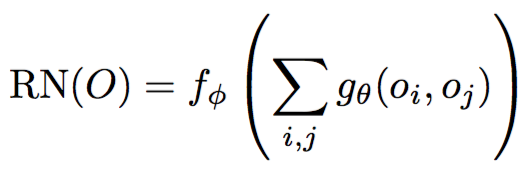
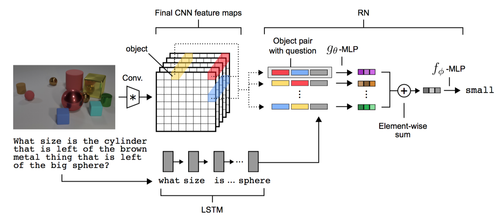
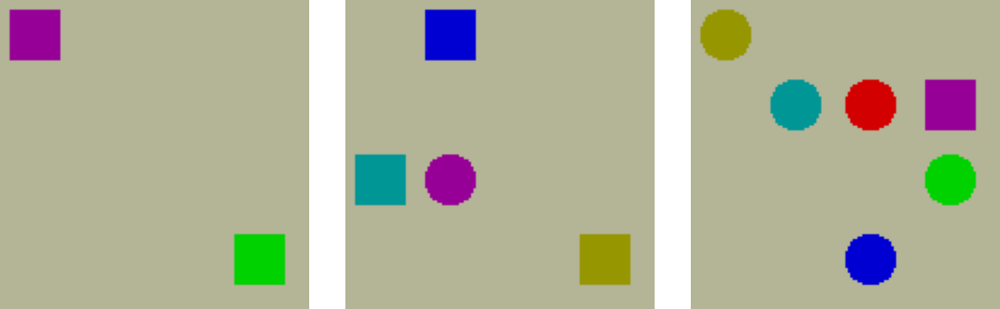
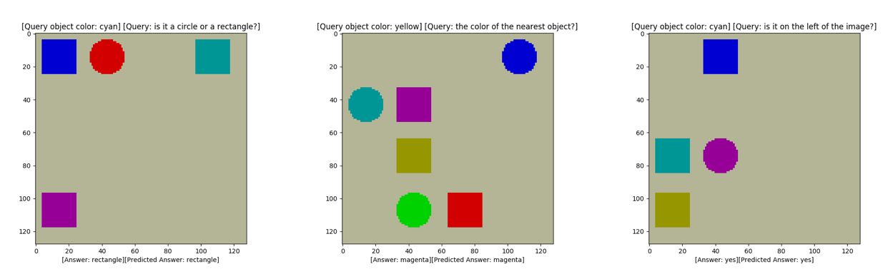
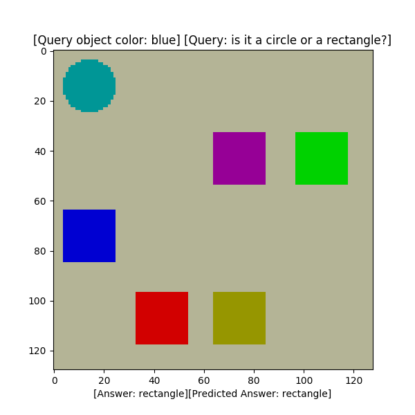
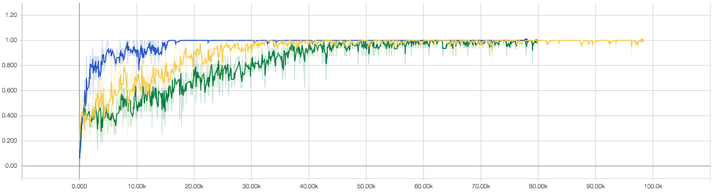
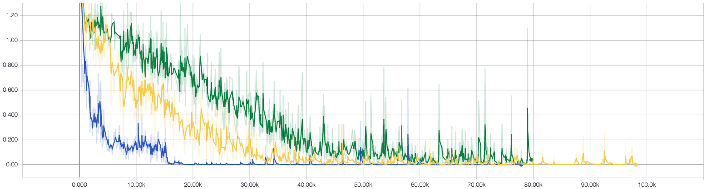
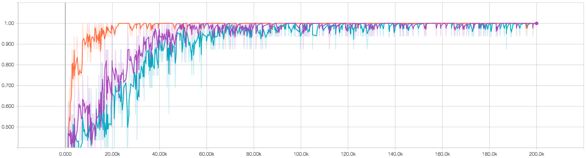
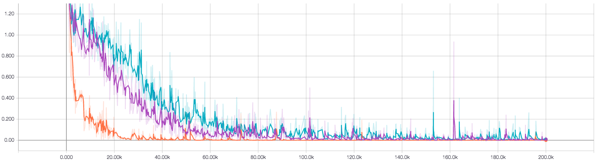

# Relation Networks and Sort-of-CLEVR in Tensorflow

As part of the implementation series of [Joseph Lim's group at USC](http://csail.mit.edu/~lim), our motivation is to accelerate (or sometimes delay) research in the AI community by promoting open-source projects. To this end, we implement state-of-the-art research papers, and publicly share them with concise reports. Please visit our [group github site](https://github.com/gitlimlab) for other projects.

This project is implemented by [Shao-Hua Sun](https://github.com/shaohua0121/) and reviewed by [Youngwoon Lee](https://github.com/youngwoon).

## Descriptions
This project includes a [Tensorflow](https://www.tensorflow.org/) implementation of **Relation Networks** and a dataset generator which generates a synthetic VQA dataset named **Sort-of-CLEVR** proposed in the paper [A Simple Neural Network Module for Relational Reasoning](https://arxiv.org/abs/1706.01427).

### Relation Networks

Relational reasoning is an essential component of intelligent systems. To this end, Relation Networks (RNs) are proposed to solve problems hinging on inherently relational concepts. To be more specific, RN is a composite function:

<p align="center">
    ,
</p>

where *o* represents inidividual object while *f* and *g* are functions dealing with relational reasoning which are implemented as MLPs. Note that objects mentioned here are not necessary to be real objects; instead, they could consist of the background, particular physical objects, textures, conjunctions of physical objects, etc. In the implementation, objects are defined by convoluted features. The model architecture proposed to solve Visual Question Answering (VQA) problems is as follows.

<p align="center">
    
</p>

In addition to the RN model, **a baseline model** which consists of convolutional layers followed by MLPs is also provided in this implementation. 

### Sort-of-CLEVR

To verify the effectiveness of RNs, a synthesized **VQA dataset** is proposed in the paper named Sort-of-CLEVR. The dataset consists of paired questions and answers as well as images containing colorful shapes. 

Each **image** has a number of shapes (rectangle or circle) which have different colors (red, blue, green, yellow, cyan,  or magenta). Here are some examples of images.

<p align="center">
    
</p>

**Questions** are separated into relational and non-relational questions which are encoded as binary strings to prevent the effect of language parsing and embedding; while **answers** are represented as one-hot vectors. Examples of images, questions and answers are as follow.

<p align="center">
    
</p>

Given a queried color, all the possible questions are as follows.

**Non-relational questions**

* Is it a circle or a rectangle?
* Is it closer to the bottom of the image?
* Is it on the left of the image?

**Relational questions**

* The color of the nearest object?
* The color of the farthest object?

And the possible answer is a fixed length one-hot vector whose elements represent

*[red, blue, green, yellow, cyan, magenta, circle, rectangle, yes, no]*

**File format**

Generated files use HDF5 file format. Each data point contains an *image*, an one-hot vector *q* encoding a question, and an one-hot vector *a* encoding the corresponding answer.

Note that this implementation only follows the main idea of the original paper while differing a lot in implementation details such as model architectures, hyperparameters, applied optimizer, etc. Also, the design of Sort-of-CLEVR only follows the high-level ideas of the one proposed in the orginal paper.

\*This code is still being developed and subject to change.

## Prerequisites

- Python 2.7 or Python 3.3+
- [Tensorflow 1.0.0](https://github.com/tensorflow/tensorflow/tree/r1.0)
- [NumPy](http://www.numpy.org/)
- [PIL](http://pillow.readthedocs.io/en/3.1.x/installation.html)
- [matplotlib](https://matplotlib.org/)
- [h5py](http://docs.h5py.org/en/latest/)
- [progressbar](http://progressbar-2.readthedocs.io/en/latest/index.html)
- [colorlog](https://github.com/borntyping/python-colorlog)

## Usage

### Datasets

Generate a default Sort-of-CLEVR dataset:

```bash
$ python generator.py
```

Or generate your own Sort-of-CLEVR dataset by specifying args:

```bash
$ python generator.py --dataset_size 12345 --img_size 256
```

Or you can even change the number of shape presented in the images, the number of possible colors, types of questions and answers by configuring the file *vqa_util.py*.

### Training

Train a RN model with a default Sort-of-CLEVR dataset:

```bash
$ python trainer.py
```

Or specify your own settings:

```bash
$ python trainer.py --model baseline --dataset_path Sort-of-CLEVR_xyz --batch_size 64 --learning_rate 1e-4 --lr_weight_decay 
```

During the training phase, the samples including images, questions, ground truth answers, and predicted answers can be monitored on Tensorboard if the library [Tensorflow Plot](https://github.com/wookayin/tensorflow-plot) is installed. Here is an example.

<p align="center">
    
</p>

### Testing

Test a trained model by specifying the dataset and the model used for training and a checkpoint:

```bash
$ python evaler.py --dataset_path Sort-of-CLEVR_default --model rn --checkpoint_path ckpt_dir
```

Please note that *ckpt_dir* should be like: ```train_dir/baseline-Sort-of-CLEVR_default_lr_0.001-20170619-040301/model-10001```

## Results

Both **the baseline model** and **the RN model** were tested on **three Sort-of-CLEVR datasets** which have 2, 4, or 6 shapes in each image, respectively. 

### Training

RN model accuracy



RN model loss



Baseline model accuracy



Baseline model loss



### Testing

Each image has 6 shapes

| | RN model | Baseline model |
| --- | --- | --- |
| Non-relational question | **93.24%** | 68.37% |
| Relational question | **70.93%** | 32.93% |
| Overall | **83.51%** | 54.19% |

Each image has 4 shapes

| | RN model | Baseline model |
| --- | --- | --- |
| Non-relational question | **97.64%** | 79.86% |
| Relational question | **75.78%** | 45.56% |
| Overall | **93.10%** | 66.10% |

Each image has 2 shapes

| | RN model | Baseline model |
| --- | --- | --- |
| Non-relational question | **99.76%** | 98.22% |
| Relational question | **100.00%** | 100.00% |
| Overall | **99.85%** | 98.93% |

### Can learned knowledge be transferred?

Models trained on 4-shape dataset and tested on 6-shape dataset

| | RN model | Baseline model |
| --- | --- | --- |
| Non-relational question | **96.51%** | 80.57% |
| Relational question | **55.07%** | 29.63% |
| Overall | **79.95%** | 60.19% |

Models trained on 4-shape dataset and tested on 2-shape dataset

| | RN model | Baseline model |
| --- | --- | --- |
| Non-relational question | **94.71%** | 91.47% |
| Relational question | 49.88% | **57.58%** |
| Overall | 76.73% | **77.95%** |

## Related works

* [A Simple Neural Network Module for Relational Reasoning](https://arxiv.org/abs/1706.01427) by 
* [Visual Interaction Networks](https://arxiv.org/abs/1706.01433) by Watters et. al.
* [Interaction networks for learning about objects, relations and physics](https://arxiv.org/abs/1612.00222) by Battaglia et. al.
* My implementation of [Semi-supervised learning GAN](https://github.com/gitlimlab/SSGAN-Tensorflow)
* My implementation of [Comparisons among SELU, ReLU, and LReLU based on visualization and histogram of activations](https://github.com/shaohua0116/Activation-Visualization-Histogram)

## Author

Shao-Hua Sun / [@shaohua0116](https://github.com/shaohua0116/) @ [Joseph Lim's research lab](https://github.com/gitlimlab) @ USC
